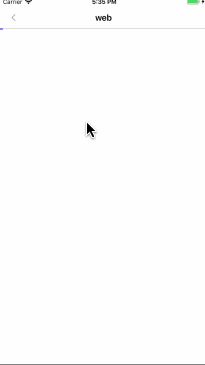

# TGWebViewController
TGWebViewController
# GIF

# 网页进度条
## 把TGWebController 拖到你的工程中 
## 导入#import "TGWebViewController.h"

    TGWebViewController *web = [[TGWebViewController alloc] init];
    web.url = @"http://www.jianshu.com/u/9e396019b1ca";
    web.webTitle = @"web";
    web.progressColor = [UIColor blueColor];
    [self.navigationController pushViewController:web animated:YES];
    
 
